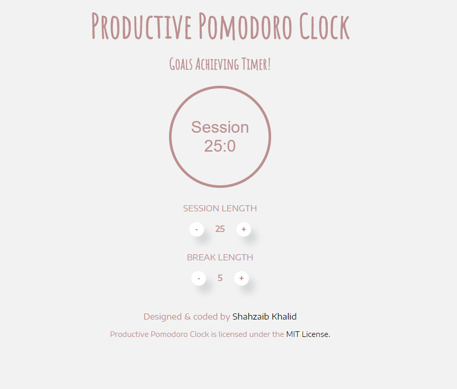
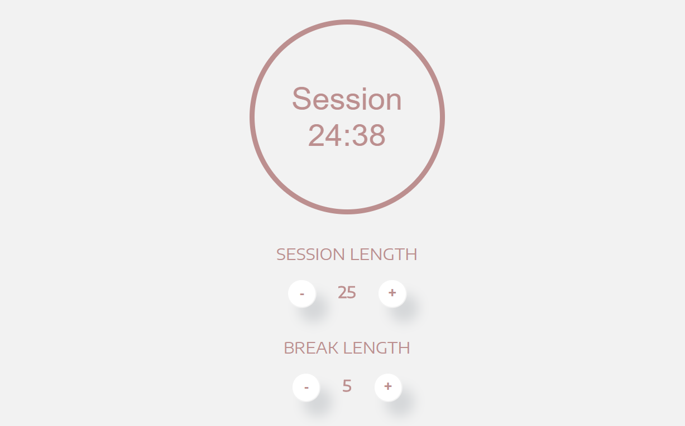

<h1 align="center">Productive Pomodoro Clock</h1>
<h3 align="center">Goals Achieving Timer</h3>

A simple to use, goals achieving Pomodoro technique timer, built using HTML, CSS &amp; JavaScript.

## Detail
Pomodoro technique is a tool to do things more productively, and so it needs productive Pomodoro timer at first. That's the reason and idea behind Productive Pomodoro Clock. It's intuitive, minimal, highly configurable and insanely simple to use timer to get things done and cleaning your to-do list more earlier.  

## Design
This is how the design looks like:

## Use
You can use Productive Pomodoro Clock by clicking [here](https://shahzaibkhalid.github.io/productive-pomodoro/)

## License
Productive Pomodoro Clock is licensed under the [MIT License](https://github.com/shahzaibkhalid/productive-pomodoro/blob/master/LICENSE.txt).

Copyright (c) 2017 Shahzaib Khalid
